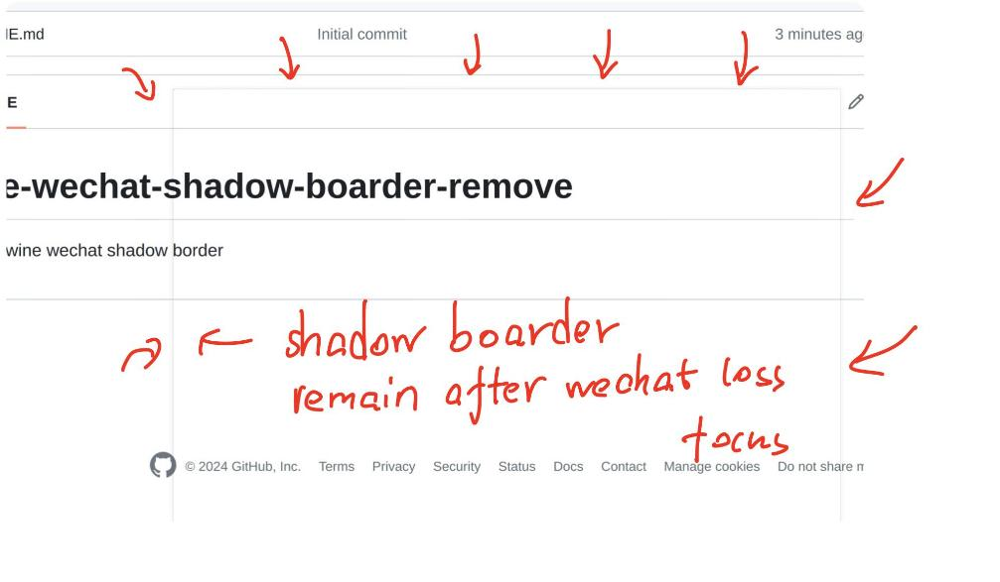

# wine-wechat-shadow-boarder-remove
A tool to remove wine wechat shadow border

The wechat-shadow-boarder remain in screen after wechat loss focus.



# Mechanism
Listen to the events of the child windows on the root window, when you receive the XCB_MAP_NOTIFY event, that is, an X window has been mapped to the desktop, then check if its WM_CLASS attribute is wechat.ex e. If it is, then check if the _NET_WM_NAME (i.e., the title of the window) is null, those shaded windows have a null title, and windows with functions do not have null titles. If yes, check that _NET_WM_NAME (the window title) is empty. If the title is empty, then check if the input field in the WM_HINTS attribute is allow input, menus, applet lists and other dialogs do not have a window title but allow input, so they should not be hidden, whereas shaded windows don't allow input, so they should be hidden.

# Build

## install dependencies

```shell
sudo apt install libx11 libxcb-icccm4-dev libxcb-util-dev
```

## Usage

### 1.build and install
```shell
make
sudo make install
```
The executable file `fix_wechat` will be install to `/opt/fix_wechat/bin/`

We need to create a desktop file to `#{HOME}/.local/share/applications/` for convenient launching.
```shell
make create_desktop
```
The above command will install `./WeChatFixBorder.desktop`.
When you launch  `WechatFix`, it will automatically launch `fix_wechat` to  process the wechat border

### 2. uninstall

```shell
rm -rf /opt/fix_wechat/
rm -rf ~/.local/share/applications/WeChatFixBorder.desktop
```

# REF
> https://12101111.github.io/block-wine-wechat-black-window/
